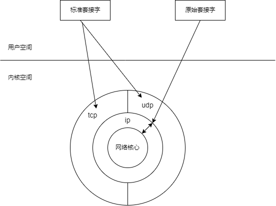
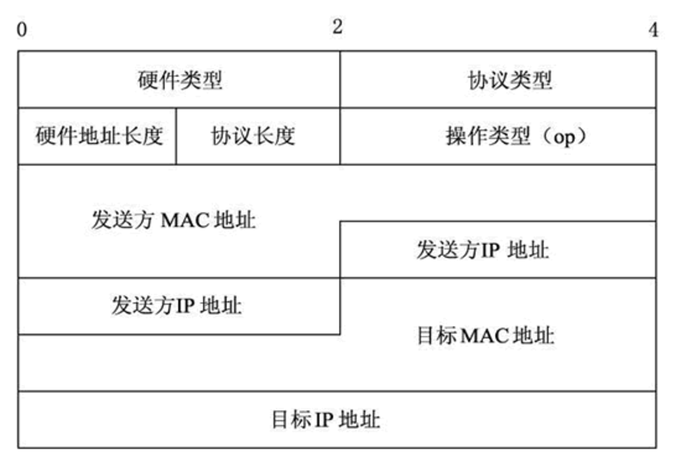

## 
sendto send write
```
sendto 发送数据，一般用于UDP，原始套接字
send(sock_fd,buf,len,0); 0是flags中的URG，紧急位
write(sock_fd,buf,len);
```

## 
recvfrom recv read
```
recvfrom 用于UDP或原始套接字的接收数据
read(sock_fd,buf,sizeof(buf));
recv(sock_fd,buf,sizeof(buf),0);
```

# 原始套接字

1. 流式套接字只能收发TCP协议的数据
2. 数据包套接字只能收发UDP协议的数据

原始套接字可以收发
1. 内核没有处理的数据包，因此要访问其他协议（运输层，网络层，链路层）
2. 发送的数据需要使用原始套接字（SOCK_RAW）




## 创建原始套接字

int socket(PF_PACKET,SOCK_RAW,protocol);
n
#### 功能：
创建链路层的原始套接字

#### 参数：
protocol:
ETH_P_IP
ETH_P_ARP
ETH_P_ALL


#### 实际使用:
#include<netinet/ether.h>
socket(PF_PACKET,SOCK_RAW,htons(ETH_P_ALL));


# mac地址解析器

# 混杂模式

1. 指一台机器的网卡能够接收所有经过他的数据包，而不论其目的地址是否是它
2. 一般计算机网卡都工作在非混杂模式下，如果设置网卡位混杂模式需要root权限

## linux设置混杂模式
1. 设置混杂模式： ifconfig eth0 promisc
2. 取消混杂模式： ifconfig eth0 -promisc

## 函数与结构体
struct ifreq{
}

ioctl();


## 用sendto发送原始套接字数据
sendto(sock_raw_fd,msg,msg_len,0,(struct sockaddr*)&sll,sizeof(sll));

<h4 style="color:red">注意：</h4>
<div style="color:red">
1. sock_raw_fd：原始套接字
2. msg：发送的消息（封装好的协议数据）
3. sll：本机网络接口，指发送的数据应该从本机的哪个网卡出去。而不是以前的目的地址。
</div> 

本机网络接口

#include<netpacket/packet.h>
struct sockaddr_ll sll;


## 获取ARP

发送ARP请求报文，报文中目的mac地址写ff:ff:ff:ff:ff:ff，
目的ip写上需要请求那一台主机的ip。

#### ARP协议格式


```
硬件类型：指明了发送方想知道的硬件接口类型，以太网的值为 1。

协议类型：表示要映射的协议地址类型。它的值为 0x0800，表示 IP 地址。

硬件地址长度和协议长度：分别指出硬件地址和协议的长度，以字节为单位。对于以太网上IP地址的ARP请求或应答来说，它们的值分别为 6 和 4。

操作类型：用来表示这个报文的类型，ARP 请求为 1，ARP 响应为 2，RARP 请求为 3，RARP 响应为 4。

发送方 MAC 地址：发送方设备的硬件地址。

发送方 IP 地址：发送方设备的 IP 地址。

目标 MAC 地址：接收方设备的硬件地址。

目标 IP 地址：接收方设备的IP地址。
```

